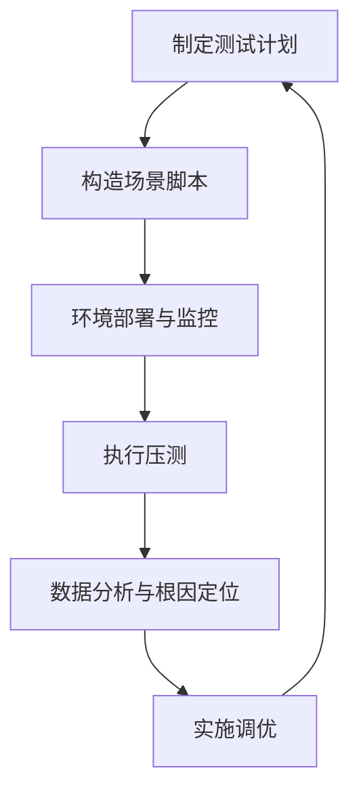

### 《性能工程闭环：从测试策略到调优实战》  
**关键词**：性能测试分类、分层分析模型、性能调优策略、全链路监控、案例实战

---

#### 一、性能测试基础认知
1. **核心目标**  
   - 量化系统能力：响应时间、吞吐量（TPS/QPS）、并发用户数、资源开销  
   - 发现潜在问题：内存泄漏、线程死锁、负载不均衡、并发安全隐患  
   - 支撑调优决策：为优化提供数据基线及验证依据  

2. **测试分类矩阵**  
   | **场景维度**       | **技术维度**                  |  
   |--------------------|-----------------------------|  
   | 单场景（接口/模块）  | 基准测试（Baseline）         |  
   | 混合业务场景        | 负载测试（Load Testing）     |  
   | -                  | 压力测试（Stress Testing）   |  
   | -                  | 稳定性测试（Soak Testing）   |  
   | -                  | 扩展性测试（Scalability Test）|

---

#### 二、性能分析核心方法论
**三层黄金法则**  
1. **分层拆解（Top-Down Analysis）**  
   ```mermaid
   graph LR
   A[用户端] --> B[CDN/网关]
   B --> C[Web服务器]
   C --> D[应用服务/微服务]
   D --> E[缓存层]
   E --> F[数据库/存储]
   ```
   - 每层检查点示例：
     - **Web层**：连接池配置、静态资源压缩  
     - **缓存层**：命中率、键淘汰策略  
     - **数据库**：慢查询、锁竞争、索引有效性  

2. **科学论证闭环（PDCA循环）**  
   ```plaintext
   问题发现 → 根因假设 → 指标预测 → 实验验证 → 结论沉淀
   ```
   - 典型案例：通过**线程堆栈分析**定位死锁（JVM的jstack工具）

3. **溯因总结（Root Cause Documentation）**  
   - 建立性能问题知识库，避免重复踩坑

---

#### 三、性能调优工具箱
| **优化策略**       | **适用场景**                  | **典型案例**               |
|-------------------|----------------------------|--------------------------|
| 异步化            | 高延迟操作（如IO/远程调用）    | MQ解耦订单支付流程         |
| 缓存分层          | 热点数据读多写少             | Redis+L1本地缓存          |
| 读写分离          | 数据库负载倾斜              | MySQL主从集群+ProxySQL    |
| 并发任务拆分      | CPU密集型计算任务           | MapReduce分治处理         |
| 弹性扩缩容        | 流量波峰波谷明显            | K8s HPA自动伸缩           |

---

#### 四、监控体系搭建指南
1. **基础设施层**  
   - **CPU**：使用率、负载均衡、上下文切换（`vmstat`）  
   - **内存**：泄漏检测（JVM GC日志分析）、Swap使用  
   - **磁盘**：IOPS、吞吐量、await时间（`iostat`）  
   - **网络**：TCP重传率、连接数（`netstat`/`ss`）  

2. **应用服务层**  
   - **Web服务器**：Nginx活跃连接数、请求排队时间  
   - **JVM**：GC暂停时长、堆内存分布（VisualVM/Arthas）  
   - **线程池**：活跃线程数、任务队列积压（Spring Boot Actuator）

3. **全链路追踪**  
   - 基于TraceID的请求拓扑（SkyWalking/Jaeger）

---

#### 五、实战调优案例
**案例1：Nginx性能瓶颈突破**  
- **问题**：压测中QPS达到2k后响应时间飙升  
- **分析路径**：  
  1. 监控发现Worker进程CPU 100%  
  2. 确认`worker_connections`超出内核限制  
  3. 日志中大量`accept4() failed (24: Too many open files)`  
- **调优方案**：  
  ```nginx
  worker_processes auto;        # 匹配CPU核心数
  worker_rlimit_nofile 100000;  # 突破文件句柄限制
  events {
    worker_connections 65535;   # 单进程最大连接数
    use epoll;                  # 启用高效IO模型
  }
  ```

**案例2：MySQL写入性能优化**  
- **问题**：批量插入时TPS波动剧烈  
- **关键发现**：  
  - InnoDB Buffer Pool写脏页延迟高  
  - 事务提交频率过高（`innodb_flush_log_at_trx_commit=1`）  
- **优化效果**：  
  ```sql
  SET GLOBAL innodb_flush_log_at_trx_commit = 2; -- 牺牲部分可靠性提升写入
  ALTER TABLE orders ENGINE=InnoDB ROW_FORMAT=COMPRESSED; -- 减少磁盘占用
  ```

---

#### 六、性能工程闭环

**核心原则**：优化必须基于数据驱动，避免经验主义！

---

**结语**：性能优化本质是**资源与效率的博弈**。掌握分层分析法、建立监控雷达网、沉淀案例知识库，方能构建高性能系统韧性。下期将深入剖析《JVM GC调优的量子力学玄学》—— 关注我避免迷路！
