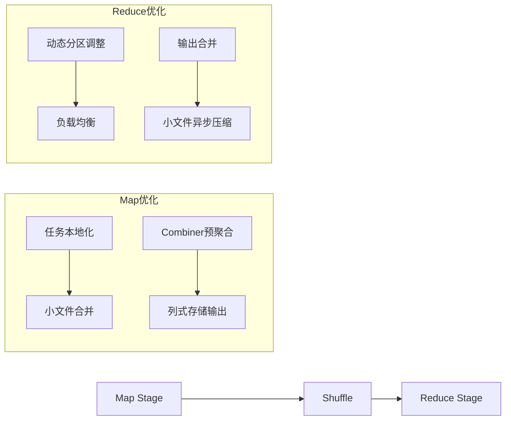
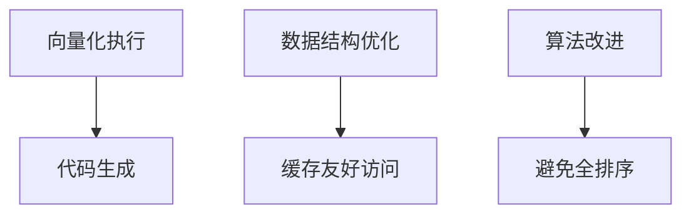
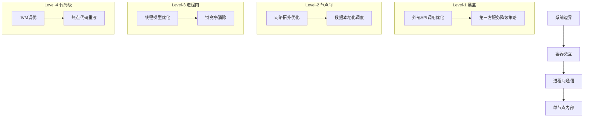

---

# 分布式系统性能优化体系

## 一、核心优化模型
### 资源调度层
| 优化方向          | 关键问题                                                                 |
|-------------------|--------------------------------------------------------------------------|
| **优先级调度**    | 高优先级任务抢占机制、队列权重分配                                       |
| **资源隔离**      | CPU/内存隔离（cgroups）、网络带宽控制                                    |
| **弹性资源池**    | 动态扩缩容策略、空闲资源回收阈值                                         |
| **防饥饿机制**    | 资源配额保底、超时任务优先级提升                                         |

### 计算任务层


#### Map阶段优化点
1. **资源规划**  
   - Executor内存/CPU配比（建议1:4核内存比）
   - 单个Container资源上限控制
2. **数据本地化**  
   - 调度策略：PREFER_LOCAL → NODE_LOCAL → RACK_LOCAL
3. **输出优化**  
   - 合并小文件（Hadoop: `CombineFileInputFormat`）
   - 启用Map端Combiner
   - 列式存储（ORC/Parquet）

#### Reduce阶段优化点
1. **并行度控制**  
   - 基于数据量自动设定Reduce数量（`hive.exec.reducers.bytes.per.reducer`）
2. **防倾斜方案**  
   - 二次分发（两阶段聚合）
   - Salting技术处理热点Key
3. **输出处理**  
   - 自动合并小文件（`hive.merge.mapredfiles=true`）

### 数据读写层
| 组件         | 优化策略                                                                 |
|--------------|--------------------------------------------------------------------------|
| **磁盘存储** | • 冷热数据分层存储（SSD/HDD）<br>• 数据压缩（ZSTD/LZ4）<br>• 分桶/分区裁剪 |
| **索引系统** | • Min-Max索引（数值范围）<br>• BloomFilter（存在性检测）<br>• Bitmap索引（高基数） |
| **网络传输** | • Zero-Copy技术（Netty）<br>• 动态压缩（Snappy）<br>• Shuffle服务化（Remote Shuffle Service） |

### CPU执行层


关键优化技术：
- **向量化引擎**（Arrow/Parquet）
- **JIT编译优化**（Spark WholeStageCodegen）
- **高效数据结构**：
  - 聚合使用HashMap替代List
  - 排序使用TimSort
  - 避免对象频繁创建（对象池）

---

## 二、SQL级优化策略
### 通用原则
1. **数据扫描控制**  
   - 禁用`SELECT *` → 指定列裁剪
   - 分区过滤避免全表扫描
2. **执行计划优化**  
   - 谓词下推（Predicate Pushdown）
   - 列剪枝（Column Pruning）

### 高阶优化技巧
| 场景                | 优化方案                                                                 |
|---------------------|--------------------------------------------------------------------------|
| **多Distinct聚合**  | 拆分为多个子查询+JOIN（避免数据膨胀）                                    |
| **大表JOIN**        | 分桶JOIN（Bucket-Map-Join）<br>广播小表（Broadcast Join）                |
| **复杂查询**        | CTE表达式（`WITH`子句复用计算结果）                                      |
| **批量写入**        | 多插入语句（`FROM ... INSERT INTO ...`）                                 |

### 典型优化案例
```sql
-- 原始低效写法
SELECT COUNT(DISTINCT user_id), COUNT(DISTINCT order_id) 
FROM orders;

-- 优化后方案
WITH 
  user_cte AS (SELECT DISTINCT user_id FROM orders),
  order_cte AS (SELECT DISTINCT order_id FROM orders)
SELECT 
  (SELECT COUNT(*) FROM user_cte),
  (SELECT COUNT(*) FROM order_cte);
```

---

## 三、C4层级优化框架
### 层级化优化路径


### 全流程优化视图
```
SQL解析 → 资源分配 → DAG调度 → 数据读取 → CPU执行 → 本地磁盘IO → 网络Shuffle → 结果输出
```
各阶段关注点：
1. **资源分配**：Slot共享 vs 独占
2. **数据读取**：索引命中率、ORC谓词下推
3. **网络传输**：Shuffle压缩率（lz4 > 80%）
4. **结果输出**：自动合并小文件（目标128MB）

---

## 四、实践原则
1. **优化前提**  
   - 明确瓶颈点（CPU/IO/网络）
   - 建立性能基线（Benchmark）
2. **避免过度优化**  
   - 遵循“5秒原则”：单任务不超过5秒不优化
   - 权衡优化成本与收益
3. **持续监控**  
   - 关键指标：  
     - GC耗时（<10%）
     - CPU利用率（70%-80%）
     - 网络丢包率（<0.1%）

> 完整工程实践参考：  
> 《性能之巅》观测方法论  
> Google SRE系统可靠性原则  
> Spark Tuning Guide官方调优指南

---
