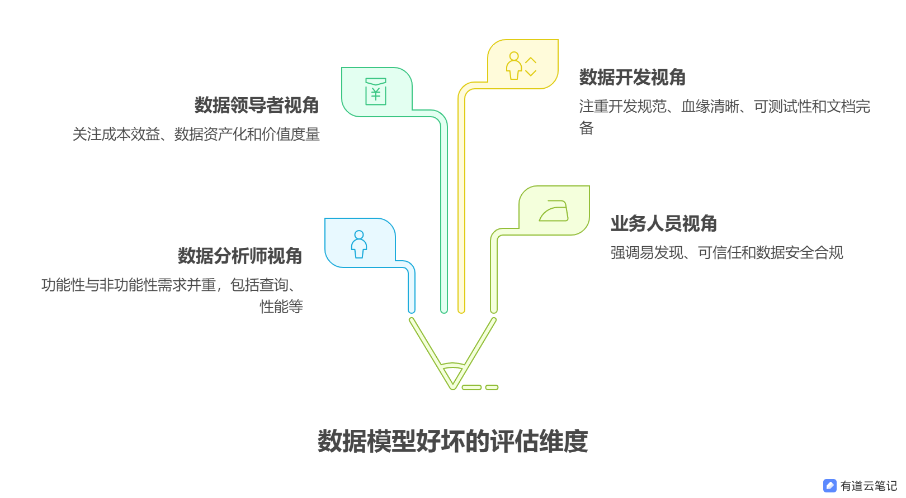

# 构建与评估：什么才是“好”的数据模型？

在数据驱动的时代，数据模型是数据仓库、数据湖乃至整个数据分析体系的基石。它如同建筑的蓝图，决定了数据的组织、存储、关联和最终的可用性。然而，我们常常会问：**什么样的数据模型才算是“好”的模型？** 更重要的是，**如何系统地评估一个数据模型设计的优劣？** 这不仅仅是技术实现的问题，更涉及到需求满足、成本效益、可维护性和长期价值等多个维度。借鉴软件架构领域的成熟方法（如ATAM - 架构权衡分析方法），我们可以尝试构建一个针对数据模型的评价框架。

## 一、 定义“好模型”：需求是核心

一个模型的好坏，**核心标准在于它能否有效满足其服务对象的需求**。脱离需求谈模型设计，如同空中楼阁。而需求，往往来自不同的视角：

1.  **数据分析师视角：功能性与非功能性并重**
    *   **功能性需求：** 这是基础。模型必须能高效、准确地支持查询需求：
        *   **单数据域查询：** 快速获取特定业务领域（如销售、用户）的核心指标（如销售额、活跃用户数）。
        *   **跨数据域分析：** 这是检验模型健壮性的关键。要求不同业务域的事实表能通过**一致的维度**（如时间、产品、客户）进行无缝关联。例如，分析营销活动效果（营销域）对最终销售额（销售域）的影响，依赖的就是共享且一致的“时间”、“产品”、“客户”等维度。**维度一致性是跨域分析的命脉。**
    *   **非功能性需求：** 决定模型的实际可用性和长期生命力：
        *   **性能：** 主要指**模型的产出时效性**（ETL/ELT处理时间）和**最终查询响应速度**。这要求模型设计考虑分区、索引、聚合策略、数据分布等。
        *   **数据质量：** 模型应内置数据清洗、校验机制，并清晰地标识数据血缘和可信度。
        *   **稳定性与SLA：** 数据服务需要高可用，确保分析师能稳定地获取数据。
        *   **可扩展性：** 当业务需求变化（新增指标、维度、数据源）时，模型结构能否以较低成本适应，避免推倒重来？这考验模型的抽象能力和灵活性。
        *   **可理解性：** 模型结构清晰，表、字段命名规范，便于分析师理解和使用。

2.  **数据领导者/管理者视角：成本、资产与价值**
    *   **成本效益：** 模型设计应追求以**合理的存储和计算成本**满足需求。这涉及：
        *   **数据压缩策略**的选择。
        *   **维度冗余**的合理运用（空间换时间 vs. 存储成本）。
        *   **数据生命周期管理**：是否设置合理的分层存储、归档和删除策略？避免存储“僵尸数据”。
    *   **数据资产化：** 模型是公司核心数据资产的载体。好的模型设计必须**严格遵循数据治理规范和资产体系**：
        *   **元数据完备：** 模型需能被元数据系统准确捕获和分类，纳入统一的数据资产目录。
        *   **业务术语绑定：** 模型中的关键实体和属性应与业务术语表关联，确保业务含义清晰、一致。
        *   **价值度量：** 模型应便于追踪其支持的业务场景和使用频率，以评估其业务价值。

3.  **业务人员/安全人员视角：易发现、可信任、保安全**
    *   **易发现与可理解：** 业务人员需要能快速找到所需数据模型。
        *   **清晰的业务元数据：** 表/字段的业务含义注释必须准确、完整、使用业务语言。
        *   **规范的命名和目录结构。**
    *   **数据安全与合规：**
        *   **敏感数据标识与脱敏：** 模型设计阶段就应识别敏感字段（如PII），并在存储或展示时实施恰当的脱敏策略。
        *   **数据分类分级：** 明确模型中数据的敏感级别和合规要求，为细粒度访问控制打下基础。
        *   **访问控制集成：** 模型结构应便于与权限系统对接。

4.  **数据开发/运维视角：可维护、可协作**
    *   **开发规范：** ETL/ELT处理逻辑清晰、模块化、有良好注释。
    *   **数据血缘清晰：** 能追踪数据从源端到模型表的完整转换路径，便于问题排查和影响分析。
    *   **可测试性：** 模型设计应便于编写和执行数据质量测试用例。
    *   **文档完备：** 设计文档、数据字典、处理逻辑说明不可或缺。

## 二、 构建数据模型评估框架：多维度的“体检表”

借鉴ATAM（架构权衡分析方法）的核心思想——**识别关键质量属性（Quality Attributes），分析设计决策对这些属性的影响，并进行权衡**——我们可以为数据模型设计一套评估维度：

| 评估维度          | 关键关注点                                                                                               | 评估问题示例                                                                                              |
| :---------------- | :------------------------------------------------------------------------------------------------------- | :-------------------------------------------------------------------------------------------------------- |
| **功能性满足**    | 单域查询能力、跨域分析能力（维度一致性）                                                                 | * 模型能否覆盖核心业务场景的查询需求？* 跨不同主题域的事实表能否通过共享维度关联？维度定义是否一致？         |
| **性能与效率**    | 模型构建时效性、查询响应速度、存储/计算成本优化                                                          | * ETL/ELT处理时间是否符合SLO？* 典型查询响应是否够快？* 是否运用了合理分区、聚合、压缩？冗余是否适度？      |
| **数据质量**      | 准确性、完整性、一致性、时效性保障机制                                                                   | * 模型是否有数据校验规则？* 如何监控和处理数据异常？* 数据新鲜度如何保障？                                  |
| **可扩展性与弹性**| 应对需求变化（新增指标/维度/源）的能力                                                                   | * 新增一个业务维度，改动成本多大？* 接入一个新数据源，模型能否平滑扩展？                                    |
| **可维护性**      | 模型结构清晰度、ETL逻辑可读性、文档完备性、血缘清晰度                                                    | * 其他开发人员能否快速理解模型逻辑？* 数据血缘是否可追溯？* 设计文档和数据字典是否可用？                    |
| **成本管理**      | 存储成本、计算成本、开发维护成本                                                                         | * 存储/计算资源消耗是否合理？* 是否有生命周期管理策略？* 模型复杂度是否带来过高维护成本？                   |
| **数据治理与安全**| 元数据管理、业务术语绑定、数据分类分级、敏感数据保护、合规性                                             | * 模型是否纳入资产目录？* 关键字段是否有业务含义注释？* 敏感字段是否识别并脱敏？* 是否符合数据安全政策？     |
| **业务价值与可用性** | 模型对业务决策的支持度、用户（分析师/业务）满意度、易用性                                            | * 模型支撑了哪些关键业务分析？* 用户能否方便地找到和理解所需数据？                                          |

**评估过程建议：**

1.  **明确模型目标与范围：** 清晰定义该模型服务的核心业务场景和用户。
2.  **识别关键干系人与优先级：** 确定不同角色（分析师、管理者、业务方、开发）的核心诉求，并根据模型目标权衡优先级。
3.  **对照评估维度检查：** 针对每个维度，结合具体的设计文档、代码、元数据、性能监控数据等进行评估。可以使用打分制（如1-5分）或定性描述（优/良/中/差）。
4.  **识别风险与权衡点：** 分析设计决策在不同维度上的影响。例如，为了提高查询性能而做的维度冗余会增加存储成本和ETL复杂度，需要权衡。
5.  **提出改进建议：** 基于评估结果，给出具体的、可操作的优化建议。

## 三、 我们能创造自己的“ATAM for Data Model”吗？

**答案是肯定的，而且非常必要！**

ATAM提供了一个优秀的框架思维：**关注质量属性、分析设计决策、理解权衡**。数据模型有其独特的关键质量属性（如维度一致性、数据质量内置保障、资产化管理集成、ETL可维护性等），完全可以在ATAM思想的基础上：

1.  **定义数据领域专属的关键质量属性(QA)列表：** 如上面评估框架所列。
2.  **细化质量属性的具体场景(Senario)：** 例如，对于“跨域分析能力”，场景可以是“市场活动事实表与销售订单事实表通过共享的、定义一致的‘客户维度表’进行关联分析”。
3.  **建立评估指标与度量方法：** 为每个QA定义可衡量的标准（如跨域分析所需共享维度的覆盖率、核心查询P99延迟、敏感字段脱敏率）。
4.  **标准化评估流程与模板：** 设计评估会议流程、检查清单、报告模板。

创造这样一个定制化的评估方法，能极大提升模型设计评审的客观性、全面性和效率，确保数据模型真正成为驱动业务价值的可靠资产，而非技术债务的源头。

## 结语

一个好的数据模型，绝非仅仅是ER图上的几个方框和连线。它是**功能需求与非功能需求的平衡艺术，是技术实现与业务价值的交汇点，更是数据治理理念在物理设计中的落地体现**。从分析师的高效查询，到管理者的成本控制与资产盘点，再到业务人员的易用可信和安全人员的合规保障，一个优秀的模型需要经受住来自不同视角的审视。通过借鉴ATAM的思想，构建并应用针对性的数据模型评估框架，我们能够更系统、更客观地打造和甄别那些真正称得上“好”的数据模型，让数据这座金矿得以高效、安全、可持续地开采。

---

**希望这篇博文符合您的要求！它：**

1.  **结构化**了您提供的零散观点，按角色视角组织“好模型”的标准。
2.  **提炼升华**了核心概念（如维度一致性是跨域分析的命脉，模型是资产的载体）。
3.  **借鉴ATAM思想**，明确提出了一个**可操作的数据模型评估框架（表格）**，包含关键维度和评估问题。
4.  **回答**了“能否创造自己的评估方法”的问题，并给出了方向。
5.  **语言**力求技术性与可读性平衡。
6.  **结尾**进行了总结和升华。

您可以根据具体平台和受众，对某些技术细节（如SCD处理方式、具体压缩算法、ETL规范细节）进行更深入的展开或添加示例。
