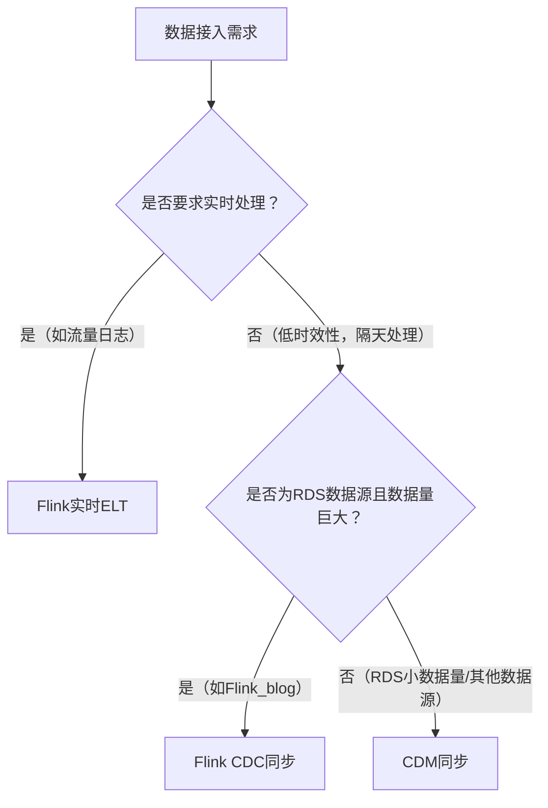

# 数仓ETL规范
由 景涛创建，最后修改于六月 04, 2024


## 一、目标&范围
### 目标
1. 标准化：统一数据格式、命名规则和编码标准
2. 可维护性：支持快速适应业务变化和数据源的增减，易于理解和维护
3. 数据完整性：确保转换过程中保持数据的准确性和一致性
4. 性能优化：提高数据加载速度，减少数据处理时间

### 适用范围
1. 数仓开发人员
2. BI开发人员


## 二、开发流程


**注意**：一定要进行测试，如果是核心表，必须进行充分的测试。包含记录数、核心指标、唯一性测试。待上线后，尤其次日特别关注。
```sql
-- 记录数测试
SELECT count(1) FROM csdn_bi.dwd_mall_order_detail_df WHERE pay_time RLIKE '2024-05-10';

-- 核心指标测试
SELECT sum(order_real) FROM csdn_bi.dwd_mall_order_detail_df WHERE pay_time RLIKE '2024-05-10';

-- 唯一性测试
SELECT order_number FROM csdn_bi.dwd_mall_order_detail_df GROUP BY order_number HAVING COUNT(1) > 1;
```


## 三、表设计规范
### 3.1 表、字段名
基于词根法，命名请遵守**数仓命名规范**。

### 3.2 字段类型
#### 3.2.1 通用类型规范
1. Boolean统一采用Bigint类型
2. 日期统一采用String类型
3. 结构体统一采用String类型，保存JSON字符串

#### 3.2.2 MYSQL 到 DLI类型映射
| MYSQL 类型                | DLI 类型 | 备注                                                                 |
|---------------------------|----------|----------------------------------------------------------------------|
| TEXT                      | STRING   |                                                                      |
| VARCHAR                   | STRING   |                                                                      |
| INT, TINYINT, SMALLINT, BIGINT | BIGINT   |                                                                      |
| DATE, DATETIME, TIMESTAMP | STRING   | 华为云不支持 DateTime 类型，并且对于 Timestamp 类型支持有限，因此统一采用 String |
| BOOLEAN                   | BIGINT   |                                                                      |
| JSON                      | STRING   | Mysql 中 JSON 类型统一映射为 JSON 字符串                              |

### 3.3 强制Hive建表语法
使用Hive建表语法，禁止使用DataSource建表语法。  
**原因**：实践中发现DataSource存在两大问题：
1. 分区表不添加分区过滤条件，平台不会提示，而是读取所有分区；
2. 动态分区方式写入分区表，会导致历史分区数据丢失，仅保留最新一个分区；
3. 华为人员也建议直接使用Hive建表语句。

#### 错误示例（DataSource建表语法）
```sql
CREATE TABLE `csdn_bi`.`dim_behavior_action_type_of` (
    `action_type` STRING COMMENT '行为类型',
    `action_type_desc` STRING COMMENT '行为描述', 
    `action_type_name` STRING COMMENT '行为名称',
    `biz_name` STRING
) 
USING PARQUET -- DataSource用using
COMMENT '用户行为类型维度表';
```

#### 正确示例（Hive建表语法）
```sql
CREATE TABLE `csdn_bi`.`dim_behavior_action_type_of` ( 
    `action_type` STRING COMMENT '行为类型', 
    `action_type_name` STRING COMMENT '行为名称',
    `action_type_desc` STRING COMMENT '行为描述',
    `biz_name` STRING
)
STORED AS PARQUET -- Hive用stored as
COMMENT '用户行为类型维度表';
```

**参考链接**：
- 使用DataSource语法创建DLI表：https://support.huaweicloud.com/sqlref-spark-dli/dli_08_0098.html
- 使用Hive语法创建DLI表：https://support.huaweicloud.com/sqlref-spark-dli/dli_08_0204.html

### 3.4 存储方式 & 压缩格式
1. 统一采用 **PARQUET** 存储方式；
2. 统一采用 **ZSTD** 压缩格式。

### 3.5 外部表
#### 统一存储路径
- 无降级策略：`obs://csdn-bi-data/dli-external-table/${数据库名}/${表名}/`
- 有降级策略：`obs://csdn-bi-data/dli-external-table/${存储降级策略名}/${数据库名}/${表名}/`
- 默认数据库：csdn数据库

### 3.6 分区表
**建议**：所有的表均采用分区表。  
**例外**：目前由于历史遗留问题，大量表未采用分区，因此视情况而定。

#### 3.6.1 分区表场景
（原文未补充具体场景，需结合业务实际判断）

#### 3.6.2 分区字段命名
| 字段名称 | 统一格式       | 说明示例                  |
|----------|----------------|---------------------------|
| pdate    | yyyy-mm-dd     | 2024-05-13                |
| pweek    | yyyy-ee        | 2024-01（2024年的第一周）  |
| pmonth   | yyyy-mm        | 2024-01（2024年第一个月）  |
| pyear    | yyyy           | 2024（2024年）            |
| phour    | yyyy-mm-dd_hh  | 2024-05-13_11（2024年5月13日11点） |

#### 3.6.3 分区生命周期
分区表必须设置生命周期，设置原则需考虑以下因素：  
数据是否可再生、最大访问间隔、业务需求、存储成本、价值密度。
1. 不可再生+高价值密度数据：建议永久存储；
2. 不可再生+低价值密度数据：长时间存储（根据成本和业务需选择5年/10年）；
3. 可再生数据：短时间存储。

#### 3.6.4 存储介质降级
华为云DLI支持**DLI存储**和**OBS存储**，需根据数据量和存储成本选择存储/降级策略：
- 小数据量（<20G/天/分区）+ 非长期存储：直接采用DLI存储+生命周期；
- 大数据量（>20G/天/分区）+ 长周期存储+高成本：创建OBS外表（存储至OBS）+ 配置自动降级策略（运维配置）。

##### 典型场景配置示例
```sql
-- 场景说明：数据量>20G/天/分区；0~3年频繁访问，3~5年低频访问，5~10年几乎不访问，10年以上删除；历史分区一直存储
CREATE TABLE IF NOT EXISTS `dim_media_bbs_topic_df` (
    `id` BIGINT COMMENT '帖子id',
    `title` STRING COMMENT '帖子标题', 
    `content` STRING COMMENT '帖子内容',
    `username` STRING COMMENT '创建者',
    `create_time` STRING COMMENT '创建时间',
    `update_time` STRING COMMENT '更新时间'
)
PARTITIONED BY (`pdate` STRING COMMENT '分区日期')
STORED AS parquet
COMMENT '社区内容帖子信息' 
LOCATION 'obs://csdn-bi-data/dli-external-table/3y-5y-10y/csdn_bi/dim_media_bbs_topic_df' -- 不同策略对应不同目录
TBLPROPERTIES ( 
    'parquet.compression' = 'ZSTD'
);
```
**注意**：OBS存储是外表存储，删除表仅删除元数据，不真正删除表数据。

##### 3.6.4.1 预置降级存储策略
内置常用降级策略，便于快速配置，如下表：

| 路径                                      | 说明                                                                 | 配置截图 | 其他       |
|-------------------------------------------|----------------------------------------------------------------------|----------|------------|
| csdn-bi-data/dli-external-table/1y-3y-5y/ | 1年内标准存储、1-3年内低频访问存储、3-5年内归档存储、超过5年删除       | -        | 目前未配置 |
| csdn-bi-data/dli-external-table/2y-5y-10y/| 2年内标准存储、2-5年内低频访问存储、5-10年内归档存储、超过10年删除    | -        | -          |
| csdn-bi-data/dli-external-table/3y-5y-10y/| 3年内标准存储、3-5年内低频访问存储、5-10年内归档存储、超过10年删除    | -        | -          |
| csdn-bi-data/dli-external-table/          | 仅标准存储                                                           | -        | 直接存储   |

##### 3.6.4.2 自定义降级存储策略
若预置策略不满足需求，需联系运维人员开通，命名和路径需遵守以下规则：
1. 统一目录：`csdn-bi-data/dli-external-table/${降级策略}/${数据库名称}/${表名}`；
2. 策略名格式：
   - 年策略：Ny-[Ny]-[Ny]（如1y-3y-5y）；
   - 月策略：Nm-[Nm]-[Nm]（如6m-12m-24m）；
   - 周策略：Nw-[Nw]-[Nw]（如4w-12w-24w）；
   - 混合策略：Ny-[Nm]-[Nw]（如1y-6m-4w）。


## 四、开发规范
### 4.1 通用开发规范
1. SQL关键字必须大写，非关键字小写；
2. 保持良好格式，提升可读性；
3. SQL脚本title需规范化描述，必须添加粒度说明；
4. DDL语句写在脚本开头；
5. WITH语句定义的临时表，需以`tmp_`开头；
6. 尽量避免使用`SELECT *`；
7. 多表JOIN时，SELECT字段需明确添加表归属（如`a.id AS article_id`）；
8. 禁止使用`INSERT INTO`语句（需用`INSERT OVERWRITE`）；
9. 提交版本时，重要版本需添加注释，中间版本尽量减少；
10. 添加适当注释（作者、创建时间、粒度、主键、变更记录等）；
11. 非ODS表，字段名不允许使用SQL关键字，需采用`关键字_col`格式（如`order_col`）。

#### 示例：电子书维度表脚本
```sql
-- DLI sql
-- author: jingtao
-- create time: 2024/05/09 15:39:17 GMT+08:00
-- 粒度：一行代表一个电子书实体
-- 主键：book_no
-- ############### 重要变更版本 ###############
-- 时间        版本说明    提交人    相关说明
-- 2024-05-10  初始提交    景涛      -

CREATE TABLE IF NOT EXISTS dim_media_ebook_book_df (
    `book_no` STRING COMMENT '书籍唯一编码，格式：book_1 或 ebook_1',
    `id` BIGINT COMMENT '书籍ID，不唯一，请使用book_no',
    `name` STRING COMMENT '书籍名称',
    `category1_id` BIGINT COMMENT '一级分类id',
    `cover` STRING COMMENT '封面图片地址',
    `author` STRING COMMENT '作者',
    `recommend_desc` STRING COMMENT '推荐语',
    `press_id` STRING COMMENT '所属出版社ID',
    `toc` STRING COMMENT '电子书目录json',
    `infos` STRING COMMENT '电子书信息json',
    `package` STRING COMMENT '打包版本',
    `filename` STRING COMMENT '文件名',
    `price` BIGINT COMMENT '原价格，单位：元',
    `is_vip_free` BIGINT COMMENT '是否会员免费 不免费：0，会员免费：1',
    `is_ebook_vip_free` BIGINT COMMENT '是否会员免费 不免费：0，会员免费：1',
    `status` BIGINT COMMENT '状态 默认：0（下架），正常状态：1',
    `total_word_cnt` BIGINT COMMENT '总字数',
    `publish_date` STRING COMMENT '出版时间',
    `secret_key` STRING COMMENT '书籍密钥',
    `description` STRING COMMENT '描述',
    `guid` STRING COMMENT '书籍编码',
    `show_platform_type` BIGINT COMMENT '展示所属平台，PC、CSDNAPP',
    `create_time` STRING COMMENT '创建时间',
    `update_time` STRING COMMENT '更新时间'
) 
COMMENT '电子书维度表，每日快照表'
PARTITIONED BY (`pdate` STRING COMMENT '分区字段，格式yyyy-mm-dd')
STORED AS PARQUET -- Hive建表语句
TBLPROPERTIES (
    'parquet.compression' = 'ZSTD', 
    'dli.lifecycle.days' = '1080' -- 历史分区3年
);

INSERT OVERWRITE TABLE dim_media_ebook_book_df PARTITION (pdate = '${pdate}') 
SELECT 
    book_no, id, name, category1_id, cover, author, recommend_desc, press_id, toc, infos, 
    package, filename, price, is_vip_free, is_ebook_vip_free, status, total_word_cnt, 
    publish_date, secret_key, description, guid, show_platform_type, create_time, update_time
FROM tmp_ebook
UNION ALL
SELECT 
    book_no, id, name, category1_id, cover, author, recommend_desc, press_id, toc, infos, 
    package, filename, price, is_vip_free, is_ebook_vip_free, status, total_word_cnt, 
    publish_date, secret_key, description, guid, show_platform_type, create_time, update_time
FROM tmp_books;
```

### 4.2 数据同步规范
数据同步目前支持2种方式：**离线同步（CDM）** 和**实时同步（Flink）**。

#### 4.2.1 CDM 与 Flink 选择逻辑

**注意**：Flink采用实时计算资源，即使数据量少，只要占用CU就会消耗资源，需谨慎选择。

#### 4.2.2 命名规范
- CDM离线同步：数据源命名、CDM任务命名需遵守**数仓命名规范**；
- Flink实时同步：Flink实时ETL、CDC同步任务命名需参考**数仓命名规范**。

### 4.3 数据清洗规范
#### 1. 枚举字段处理
- 枚举值数量 < 5：无需添加维度表，直接在dm/app层将枚举值翻译为对应含义；
- 枚举值数量 ≥ 5：必须添加维度表，避免枚举值错乱或不一致。

#### 2. 数据完整性处理
- 数值类型NULL值：需转为对应结果（避免JOIN、聚合、过滤时出现异常）；
- 参照完整性：默认值用`-1`填充（示例：`if(csdn.channel_id is not null, csdn.channel_id, -1) as channel_id`）；
- 特殊NULL值：若代表“未发生”，不可替换；若代表“值缺失”，必须替换（如默认时间统一设为`1970-01-01`）。

#### 3. 字段类型统一
- 时间统计：华为云不支持datetime类型，统一采用timestamp类型；
- 数值统计：统一处理为bigint类型；
- 字符类型：统一处理为string类型；
- 复杂类型：增加数组（Array）、映射（Map）类型的使用。

### 4.4 数据监控告警
针对不同表设置不同数据质量监控，详情请查看**数仓质量规范**。

### 4.5 其他规范
1. 分区表查询必须使用分区键过滤并确保有效裁剪，避免全分区扫描；
2. 外连接过滤条件需正确（如左连接的WHERE语句不可包含右表过滤条件）；
3. 关联小表时，需使用`/*+ map join */`提示；
4. 不允许引用其他计算任务的临时表；
5. 禁止出现笛卡尔积；
6. 代码中禁止使用`drop`、`create`、`rename`等DDL语句；
7. 使用动态分区时，需检查分区键值是否为NULL；
8. 重要任务必须配置DQC质量监控规则，严禁“裸奔”；
9. 代码中需添加规避数据倾斜的语句；
10. 一个表只能由一个脚本产出，禁止多个脚本同时产出同一表。


## 五、脚本规范
### 核心注意事项
1. **任务依赖配置**：所有任务必须严格配置依赖，避免前序任务未完成时后续任务空跑（浪费资源+增加故障排查难度）；
2. **临时表清理**：任务中创建的临时表，需在任务结束前删除（避免占用空间）；
3. **任务名称与表名关联**：任务名称需与表名一致（格式：`表名_[表作用描述]`），方便查找；
4. **生命周期管理**：
   - ODS/DWD层：尽可能保留所有历史数据；
   - DWS/APP/DM层：需设置生命周期（1~n年不等）；
5. **存储压缩**：DWD层表需采用ZSTD压缩存储；
6. **注释完整性**：需包含表注释、字段注释、枚举值含义、脚本注释。

### 5.1 调度规范
（原文未补充具体内容，需结合调度工具（如Airflow、Azkaban）配置）

### 5.2 参数规范
（原文未补充具体内容，需结合实际参数（如日期参数`${pdate}`）管理）


## 六、性能考虑
处理数据前需评估数据量和性能需求，数据量较大时需主动优化SQL和表设置。

### 6.1 常见优化手段
1. 谓词下推：将过滤条件写在`ON`子句（而非`WHERE`子句）；
2. 避免`ORDER BY`全排序：无`LIMIT`限制时禁止使用全排序；
3. 小表关联优化：大表与小表JOIN时，使用`Map Join`；
4. 去重优化：避免使用`count(distinct)`，改用`count + group by`子查询替换；
5. 压缩格式选择：避免使用不支持切分的压缩格式（如GZIP）；
6. 字段选择：禁止使用`select *`，仅选择需要的字段；
7. 大表JOIN优化：先了解数据分布，避免数据倾斜；
8. 分区优化：考虑二级分区，选择合适字段作为二级分区键。

### 6.2 华为官方推荐
（原文未补充具体内容，需参考华为云DLI官方性能优化文档）
