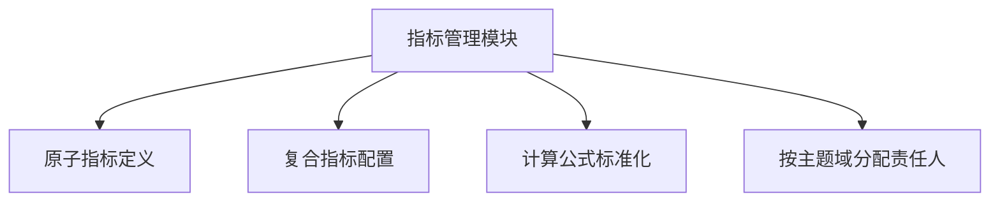
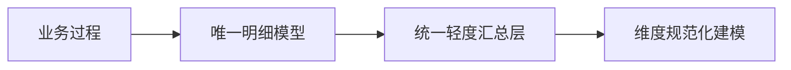
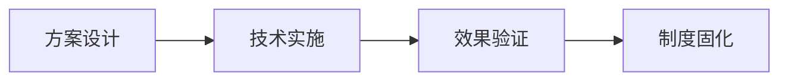

# 三步构建数据一致性保障体系：从指标治理到源头防控

## 一、数据一致性问题的本质
在数据仓库建设过程中，**数据一致性问题**主要表现为：
1. 同一指标在不同看板展示结果不一致
2. 单个指标逻辑计算结果存在明显错误
这类问题直接导致数据可信度降低，严重影响决策有效性。


## 二、根本原因分析与解决方案演进
### 阶段1：指标体系混乱（Why）
#### 问题根源：
- 📌 人员流动导致指标重复建设
- 📌 指标命名不规范（语义模糊、业务含义不明确）
- 📌 缺乏统一管理机制

#### 解决方案：构建指标管理体系


关键措施：
1. 建立企业级指标字典
2. 制定指标命名规范（e.g. `业务域_维度_度量_统计周期`）
3. 实现指标全生命周期管理

**效果**：大幅提升指标定义一致性

---

### 阶段2：模型层出口不统一（Why）
#### 问题现象：
- ADS层从不同汇总模型获取数据
- 相同指标存在多个计算路径

#### 解决方案：实施模型治理


实施规范：
1. 每个业务过程仅对应**一个核心明细层（DWD）**
2. 轻度汇总层（DWS）必须：
   - 基于统一明细层构建
   - 按维度主题域划分
3. 禁止跨层引用和非标路径计算

**效果**：消除模型层数据出口差异


---

### 阶段3：源头数据质量缺陷（Why）
#### 问题发现：
业务系统数据采集阶段存在：
- 枚举值越界
- 关键字段空值
- 异常值波动

#### 解决方案：双管齐下质量防控
**事前防控**：
```python
# 数据入仓卡点校验示例
def validate_data(row):
    assert row['user_id'] not in null_values,  # 非空校验
    assert row['status'] in ['active','inactive'], # 枚举值校验
    assert 0 < row['amount'] < 1000000,  # 值域校验
```

**事后监控**：
| 监控类型       | 检查频率 | 报警阈值   |
|----------------|----------|------------|
| 唯一性校验     | 每小时   | 重复>0.1%  |
| 枚举值校验     | 每天     | 异常>100条 |
| 波动性校验     | 每天     | ±30%       |

**效果**：问题数据拦截率提升80%+


## 三、核心方法论沉淀
### 1. 根因分析法
- 采用**5WHY分析法**层层递进
- 示例问题追溯路径：
  ```
  看板数据不一致 
  → 指标计算逻辑不同 
  → 模型引用来源不同 
  → 明细层模型冗余
  ```

### 2. PDCA闭环机制


关键要素：
- **技术手段**：质量监控平台+指标管理系统
- **流程保障**：数据开发SOP规范
- **制度约束**：数据Owner责任制


## 四、实践总结
通过三级防御体系构建：
1. 指标层：统一语义控制
2. 模型层：规范加工链路
3. 数据层：卡点+监控双保障

最终实现：
✅ 核心指标一致性达99.2%+
✅ 数据问题发现时效从天级降至分钟级
✅ 数据信任文化逐步建立


> **关键认知**：数据治理本质是**技术+制度**的协同工程，单纯工具建设只能解决表面问题。
